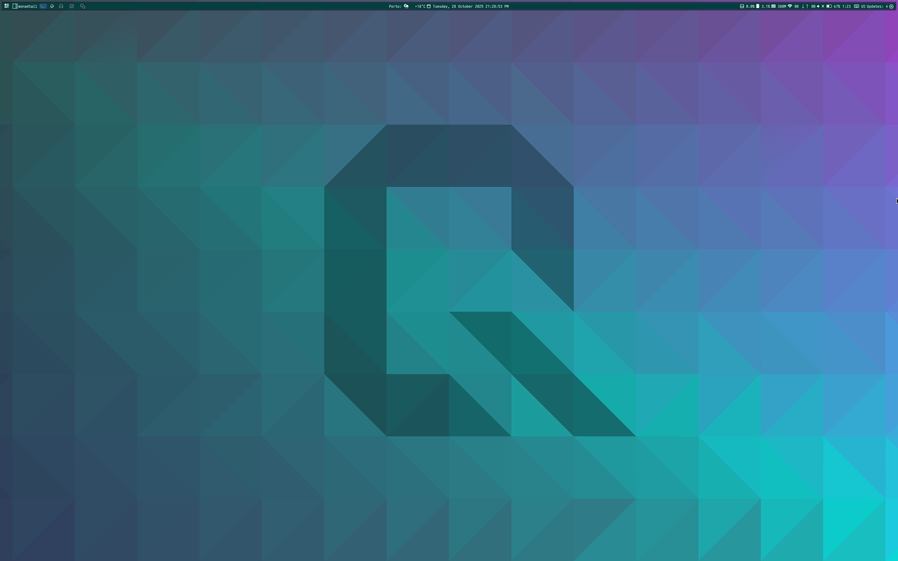

<p align="center">
  
</p>

<h1 align="center">d77-iso</h1>

<p align="center">
  Custom Arch Linux package repository -- the [custom] repo behind d77arch.
</p>

---

## Overview

A curated personal repository providing pre-built packages and configurations for Arch Linux and its derivatives.

The primary highlight of this repository is a tailored **Qtile** desktop environment bundled as a skeleton configuration (`skel`), providing an out-of-the-box, opinionated workflow alongside essential companion utilities.

<p align="center">
  
</p>

<hr>

## Included Packages

* **`d77-qtile-skel`** — Default user profile, keybindings, bar widgets, and companion scripts defining my custom Qtile setup.
* **`qtile-extras`** — Extra Qtile widgets/layouts used by the skel.
* **`arc-gtk-theme`** / **`arc-solid-gtk-theme`** — GTK theming to match.
* *Additional utility packages and patched tools as needed.*

<hr>

## Quick Setup

### 1. Add the Repository
Append the following configuration block to your `/etc/pacman.conf`:

```ini
[custom]
SigLevel = Optional TrustAll
Server = https://raw.githubusercontent.com/dani-77/d77-iso/main
```

### 2. Sync and Install

```
pacman -Sy
pacman -S d77-qtile-skel
```
